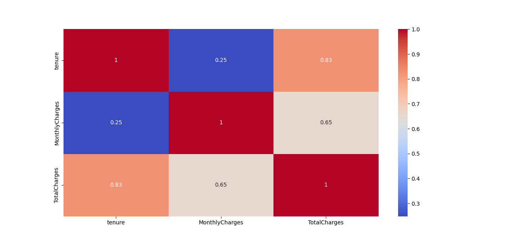
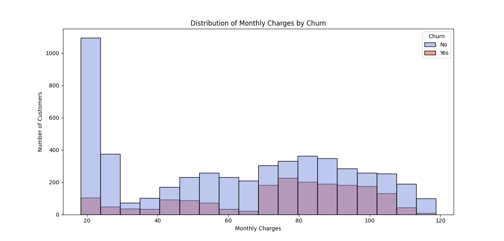
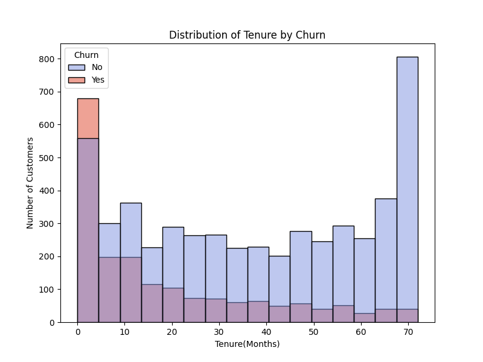
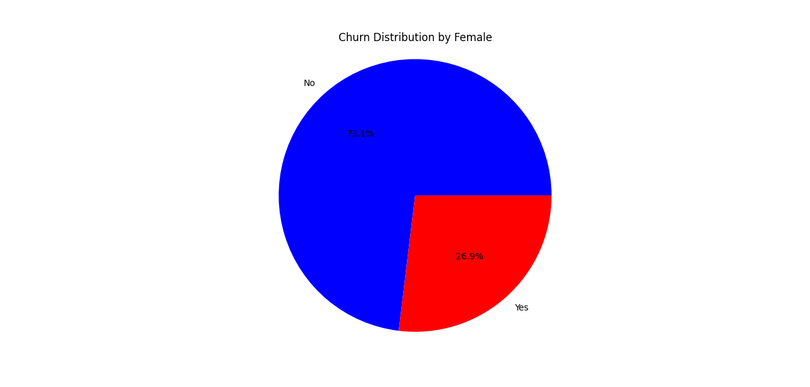

# Customer-Churn-Prediction-using-AWS-SageMaker

### Project Overview

The main idea behind this project was to explore the capabilities of **AWS Cloud** for developing and deploying a machine learning model. 
The goal was to predict customer churn (whether a customer will leave a service) and to compare a cloud-trained **XGBoost model** with a locally trained **Logistic Regression model** using the same dataset.

### Exploratory Data Analysis (EDA)

I started by performing a detailed Exploratory Data Analysis (EDA) to understand the dataset’s structure, feature distributions and correlations.

1. **Feature Categorization**

   Separated features into:

   -Cateorical features

   -Numerical features

   -Encoded categorical features(SeniorCitizen)

2. **Correlation Analysis**

   Created a heatmap to visualize correlations among all numerical features.

   

   **Finding:** Strong correlation between TotalCharges, MonthlyCharges, and tenure as expected (since TotalCharges ≈ MonthlyCharges × tenure).

3. **Target Variable Distribution (Churn)**

   

   **Finding:** There is a noticeable imbalance between churn and non-churn classes - most customers did not churn, which may cause model bias if not handled.

4. **Monthly Charges by Churn**

    Visualized how Monthly Charges differ between churned and non-churned customers.

   

   **Finding:** Customers who churned generally had higher monthly charges.

   I also computed **Spearman correlation**: 0.1847 -> Positive correlation between higher monthly charges and churn probability.

5. **Tenure by Churn**

   

   **Finding:** Customers with shorter tenure are more likely to churn.

    **Spearman correlation**:  -0.3671. The correlation is negative, therefore longer tenure leads to lower churn risk.

6. **Gender-Based Churn Distribution**

   

   

   **Finding:** Both genders show similar churn proportions - gender has little influence on churn likelihood.

### Data Preprocessing

   
   
   
   
   

   

